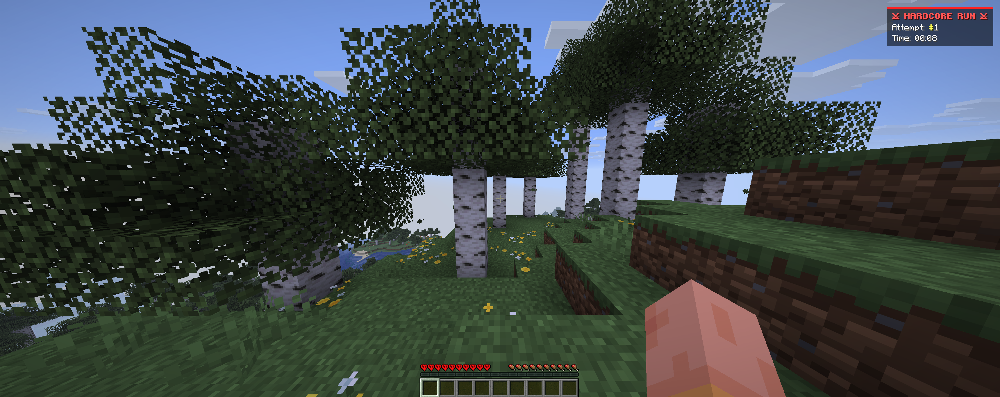
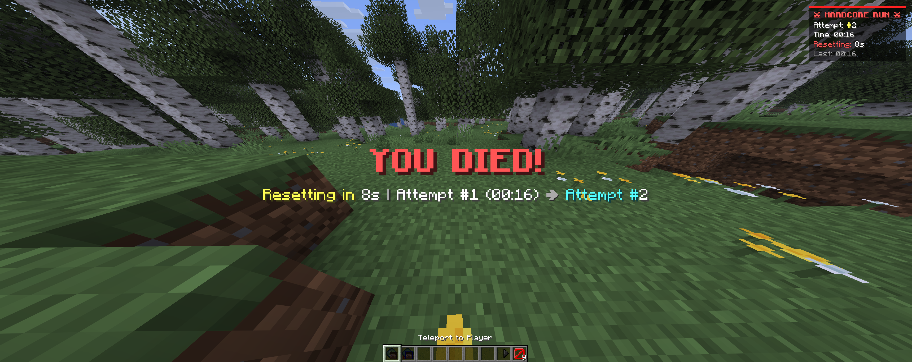
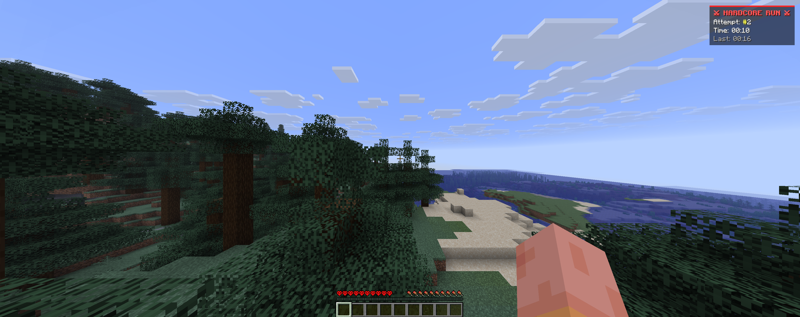
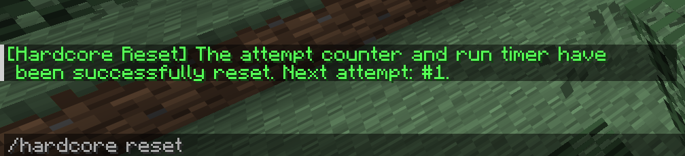

# Hardcore Reset

[English](#english) | [Español](#español)

---

## English

Have you ever died in a Minecraft Hardcore world, only to face the tedious routine of clicking Title Screen, manually deleting the world from your saves list, clicking Create New World, retyping settings, and waiting all over again?

Hardcore Reset completely solves this. It is a lightweight, seamless mod designed exclusively for **Singleplayer** that automates the entire restart process the second you die, without needing to click any buttons.

> **Important Note:** This branch is built and tested specifically for **Minecraft 26.2** running on the **Fabric** modloader. It is intended **strictly for Singleplayer** worlds.

### Version Compatibility

| Minecraft Version | Branch | Status | Recommended Release |
|---|---|---|---|
| **26.3** | `26.3` | Active / Latest | `v1.0.0+26.3` |
| **26.2** | `main` (Current) | Stable | `v1.0.0-26.2` |

If you are playing on Minecraft 26.3, please switch to the `26.3` branch or download the 26.3 release.

### What does it do?

* **Zero-Click Instant Reset**: When you take lethal damage, the mod cancels the vanilla death screen. It halts the local server cleanly, deletes the old dead world from your `/saves/` folder in the background (preventing Windows file-lock errors), and immediately launches a brand-new Hardcore world.
* **10-Second Spectator Limbo**: The moment you die, you become invulnerable and enter Spectator mode for 10 seconds. You can fly around freely to see what killed you while an on-screen countdown ticks down (`10s... 9s... 1s`).
* **Live In-Game Scoreboard (HUD)**:
  * **Attempt Counter**: Automatically tracks your runs (`#1`, `#2`, `#3`...). This counter persists even if you restart Minecraft.
  * **Live Stopwatch**: Counts upward from `00:00` while you play. Upon death, it freezes showing your exact run duration.
  * **Reset Countdown**: Shows a countdown when you die (`Resetting: 10s`).
  * **Last Run**: Displays how long your previous run lasted.
* **Smart World Naming**: New worlds are automatically named `Hardcore - Attempt #X`.
* **Built-in Languages**: English (`en_us`) and Spanish (`es_es`). If your client language is not supported, it falls back to English.
* **In-Game Command**:
  * `/hardcore reset` — Resets your attempt counter and run timer back to Attempt #1. Works directly in Hardcore mode without requiring cheats, creative mode, or opening to LAN.

### Screenshots

1. **Attempt #1 with in-game HUD scoreboard:**

2. **10-second spectator death screen with live countdown:**

3. **Automated instant respawn in fresh world (Attempt #2):**

4. **Resetting attempt and timer with `/hardcore reset`:**

### Installation

1. Download and install the [Fabric Loader](https://fabricmc.net/use/installer/) for Minecraft 26.2.
2. Make sure you have [Fabric API](https://modrinth.com/mod/fabric-api) in your `.minecraft/mods` folder.
3. Drop `hardcore_reset-1.0.0.jar` into your `.minecraft/mods` folder.
4. Launch the game, create a Hardcore world, and enjoy endless attempts.

### Found a Bug or Have a Suggestion?

If you run into any issues, unexpected crashes, or have an idea to improve the mod, please open an issue on GitHub. All feedback and bug reports are welcome.

### Support the Project

If this mod saved you time or made your Hardcore runs more enjoyable, consider leaving a star on this repository. It helps others discover the project and motivates future updates.

---

## Español

¿Alguna vez has muerto en un mundo Hardcore y has tenido que pasar por el tedioso proceso de salir al menú principal, buscar el mundo en la lista, borrarlo a mano, darle a Crear nuevo mundo, volver a configurar todo y esperar?

Hardcore Reset elimina esa molestia. Es un mod ligero y fluido diseñado exclusivamente para **Singleplayer (Un Jugador)** que automatiza todo el proceso de reinicio en cuanto mueres, sin que tengas que tocar ningún botón.

> **Nota importante:** Esta rama está compilada y preparada para **Minecraft 26.2** bajo el cargador de mods **Fabric**. Está diseñado **únicamente para partidas en solitario (Singleplayer)**.

### Compatibilidad de Versiones

| Versión de Minecraft | Rama | Estado | Release Recomendada |
|---|---|---|---|
| **26.3** | `26.3` | Activa / Última | `v1.0.0+26.3` |
| **26.2** | `main` (Actual) | Estable | `v1.0.0-26.2` |

Si juegas en Minecraft 26.3, cambia a la rama `26.3` o descarga la release correspondiente a 26.3.

### ¿Qué funciones incluye?

* **Reinicio Automático con 0 Clics**: Al recibir daño mortal, el mod cancela la pantalla roja de muerte vanilla. Desconecta de forma limpia el servidor interno, borra la carpeta del mundo muerto en `/saves/` en segundo plano (sin bloqueos de archivos en Windows) y genera de inmediato un nuevo mundo Hardcore.
* **Limbo de 10 Segundos en Espectador**: Al morir, te vuelves invulnerable y pasas automáticamente a modo Espectador durante 10 segundos. Puedes volar libremente por la zona para ver qué monstruo o trampa acabó contigo mientras una cuenta regresiva en pantalla descuenta segundo a segundo (`10s... 9s... 1s`).
* **Scoreboard en Pantalla (HUD en tiempo real)**:
  * **Contador de Intentos**: Lleva la cuenta de tus partidas (`#1`, `#2`, `#3`...). Este número se guarda de forma persistente aunque cierres el juego.
  * **Cronómetro en Vivo**: Cuenta hacia adelante desde `00:00`. Al morir, se congela mostrando exactamente cuánto duró tu intento.
  * **Cuenta atrás de Reinicio**: Muestra los segundos restantes antes del cambio de mundo (`Reiniciando: 10s`).
  * **Última Run**: Muestra la duración que tuvo tu intento anterior.
* **Nombres Automáticos**: Cada nuevo mundo generado se titula automáticamente como `Hardcore - Intento #X`.
* **Soporte de Idiomas**: Español (`es_es`) e Inglés (`en_us`). Si juegas en otro idioma, usará el inglés por defecto.
* **Comando Cómodo**:
  * `/hardcore reset` — Reinicia el contador de intentos y el cronómetro al Intento #1. Funciona directamente en Hardcore sin necesidad de trucos, creativo ni abrir a LAN.

### Capturas de pantalla

1. **Intento #1 con HUD / Scoreboard en directo:**

2. **Limbo de 10 segundos en espectador con cuenta atrás:**

3. **Carga automática del nuevo mundo (Intento #2):**

4. **Reinicio de estadísticas con `/hardcore reset`:**

### Instalación

1. Descarga e instala Fabric Loader para Minecraft 26.2.
2. Asegúrate de tener Fabric API en tu carpeta `.minecraft/mods`.
3. Pega el archivo `hardcore_reset-1.0.0.jar` en la carpeta `.minecraft/mods`.
4. Inicia Minecraft, crea un mundo Hardcore y a jugar.

### ¿Has encontrado un fallo o problema?

Si encuentras algún error, mal funcionamiento o tienes alguna sugerencia para mejorar el mod, por favor abre una incidencia (Issue) en GitHub. Cualquier reporte o comentario constructivo es bienvenido y ayuda a mejorar el proyecto.

### Apoya el Proyecto

Si el mod te resulta útil para tus retos o series de Hardcore, agradecería que dejes una estrella en este repositorio. Ayuda a que más jugadores lo conozcan y me anima a seguir manteniéndolo actualizado.

---

## Licencia / License

This project is licensed under the [MIT License](LICENSE).
